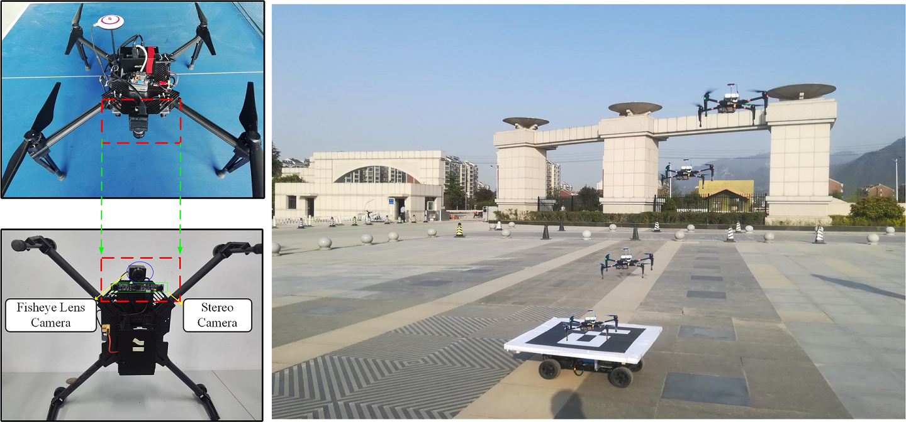
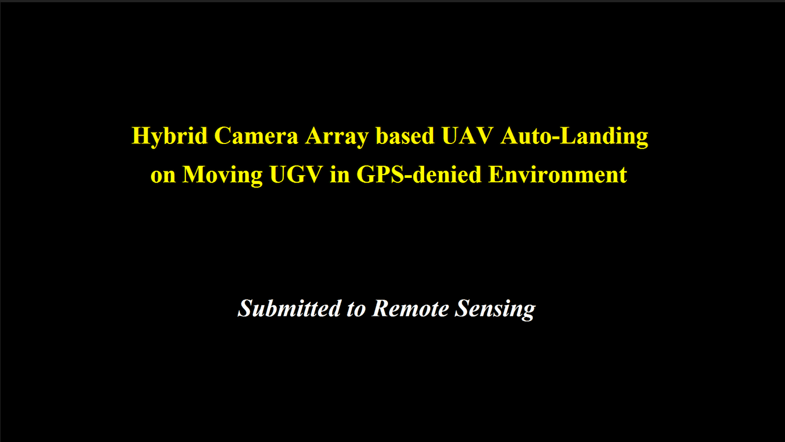

## Abstract

With the rapid development of Unmanned Aerial Vehicle (UAV) systems, the autonomous landing of UAV on moving Unmanned Ground Vehicle (UGV) has received extensive attention as one of the key technologies. However, compared with the landing of UAV on static platform, this technology is confronted with such problems as GPS-denied environment, low accuracy of target location, poor precision of relative motion estimation, delay of control response, slow processing speed and poor stability. To address these issues, we present a hybrid camera array based autonomous landing of UAV on moving UGV in GPS-denied environment. We first build an UAV autonomous landing system with a hybrid camera array including a fisheye lens camera and a stereo camera. Then we integrate wide Filed of View (FOV) and depth to locate the UGV accurately and present a state estimation algorithm for ground moving UGV based on motion compensation, including its actual motion direction and speed. Thereafter, according to the characteristics of the designed system, we derive a nonlinear controller based on the UGV motion state, which makes UGV and UAV keep the same motion state and achieve autonomous landing. Finally, in order to evaluate the performance of the proposed system, we carry out a large number of simulation in AirSim and real-world experiments. Through the qualitative and quantitative analysis of the experimental results, as well as the analysis of the time performance, we verify that the autonomous landing performance of the system in the GPS-denied environment is effective and robust.

## UAV-UGV Auto-Landing System

An illustration of our proposed hybrid camera array based UAV-UGV autonomous landing system. 

## Perofrmance
[(https://pan.baidu.com/s/10yXunEACrrC9ryFsFTtKPg)

Demo video for Hybrid camera array based UAV Auto-Landing on Ground Moving UGV in GPS-denied Environment can be download [here](https://pan.baidu.com/s/10yXunEACrrC9ryFsFTtKPg). 
